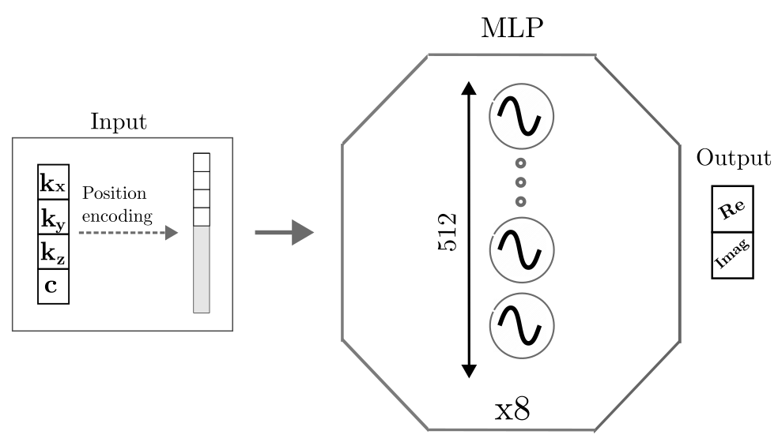
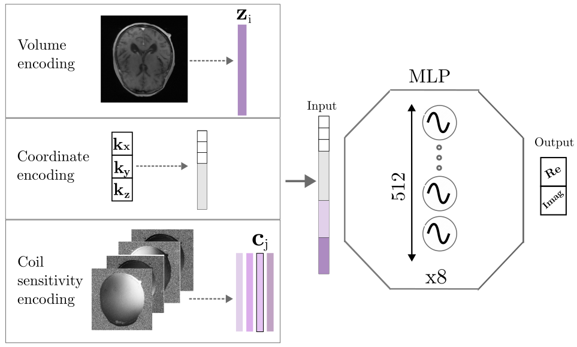

# MRI_reconstruction

This code forms part of my research project on Neural Implicit Fields for MRI reconstruction at CVL, ETH Zürich 👩‍💻.

As part of the experiments performed:

- **Single Volume training**

  
Folders relevant 🖇️: `single_vol`, `single_vol_hash`

  **single_vol** contains the implementation of the PISCO regularization method 

  **single_vol_hash** contains the implementation of the hash encodings  

- **Multi Volume training**

  
Folders relevant 🖇️: `multi_vol_hash`, `multi_vol_coil`, `multi_gpu_coil`, `multi_gpu_hash`

  **multi_vol_coil** contains the necessary functions to run the multi-volume experiments optimizing the volume and coil embeddings

  **multi_vol_hash** contains the necessary functions to run the multi-volume experiments with the coordinate hash encodings implementation

If a multi-gpu setup is needed, check the adapted codes on the folders: `multi_gpu_coil`, `multi_gpu_hash`
The `config.yaml` file can be found in all the folders, modified accordingly.
 
To setup the environment use the `mri_env.yaml` file containing the relevant packages to be installed 🚀

Check the report `research_project.pdf` to go more in depth on the methodology/ experiments performed 🔎

